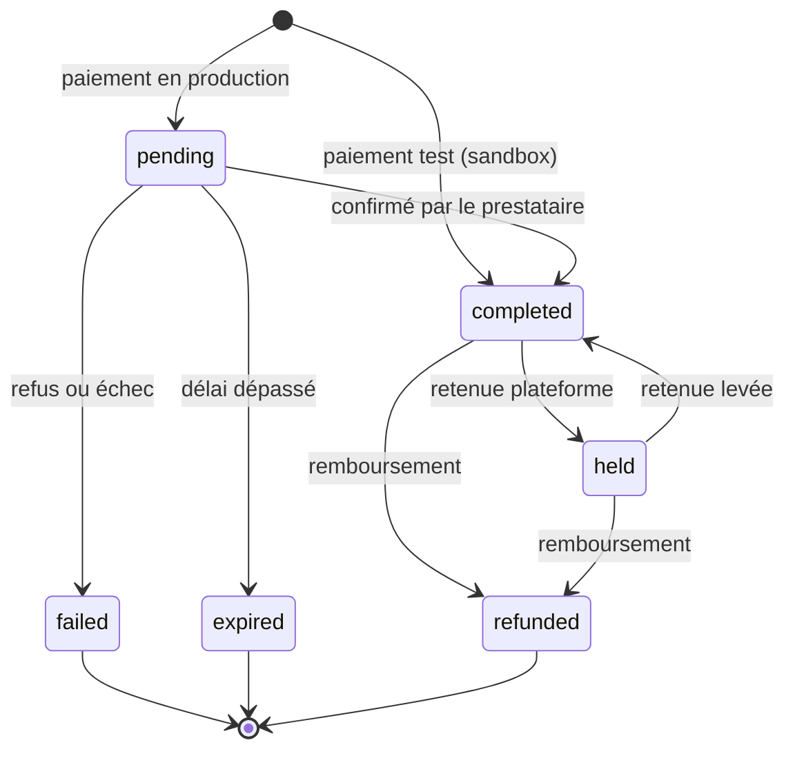

import { Accordion, Accordions } from 'fumadocs-ui/components/accordion';

Ce guide décrit le cycle de vie d'un paiement dans lomi., du `pending` au `completed`, en passant par l'échec ou l'expiration. Pour le code côté serveur, voir [Pour les contributeurs](#pour-les-contributeurs).

## Parcours d'un paiement

En **test**, un paiement est souvent `completed` tout de suite. En **production**, il reste en général `pending` jusqu'à ce que le client valide (mobile money, carte, etc.).

## Les statuts

| Statut | Ce que ça veut dire |
| --- | --- |
| `pending` | Paiement lancé, résultat pas encore connu (fréquent en production). |
| `completed` | Paiement réussi ; le solde est crédité selon les règles lomi. |
| `held` | Paiement capturé mais bloqué par la plateforme. Non retirable, hors revenus tant que la retenue n'est pas levée ou remboursée. |
| `failed` | Le paiement n'a pas abouti. |
| `expired` | Le client n'a pas finalisé à temps. |
| `refunded` | Remboursement effectué sur ce paiement. |

## Côté prestataire (Wave, MTN, etc.)

Chaque statut transaction a un équivalent côté prestataire :

| Statut transaction | Statut prestataire |
| --- | --- |
| `completed` | `succeeded` |
| `held` | `succeeded` |
| `pending` | `processing` |
| `failed` | `cancelled` |
| `expired` | `expired` |
| `refunded` | `refunded` |

Voir [Transactions](/build/money/transactions) pour les champs dans les réponses API.

## Quand le statut passe à `completed`

- Un **double webhook** ne crédite pas le solde deux fois : lomi. fusionne les métadonnées et ne crédite qu'une fois.
- Les **métadonnées** s'ajoutent au fil des webhooks, elles ne sont pas écrasées.

## Expiration

Un paiement `pending` peut expirer automatiquement :

- après un certain **délai** ;
- ou quand la **session prestataire** expire (ex. Wave).

L'info d'expiration est stockée dans `expiration_info` sur la transaction.

## Effets d'un paiement réussi

1. Le **coupon** utilisé est comptabilisé.
2. Le **solde** est mis à jour (`metadata.balance_updated` évite un double crédit).
3. Un **abonnement** lié peut passer de `pending` à `active`.

Pour le délai de disponibilité des fonds, voir [Solde et règlement](/build/money/balance-and-settlement).

## Voir aussi

- [Cycle de vie des paiements](/build/reliability/payment-lifecycle)
- [Vérifier les paiements](/build/reliability/verify-payments)
- [Comportement du checkout](/build/accept/checkout-behavior)
- [Recevoir les webhooks](/build/reliability/handling-webhooks)

<Accordions type="single">
  <Accordion title="Pour les contributeurs" id="pour-les-contributeurs">
    Côté serveur : `create_transaction`, `update_transaction_status`, jobs d'expiration et soldes dans `apps/api`. Si vous changez un statut, mettez à jour cette page et lancez `pnpm docs:drift`.
  </Accordion>
</Accordions>
