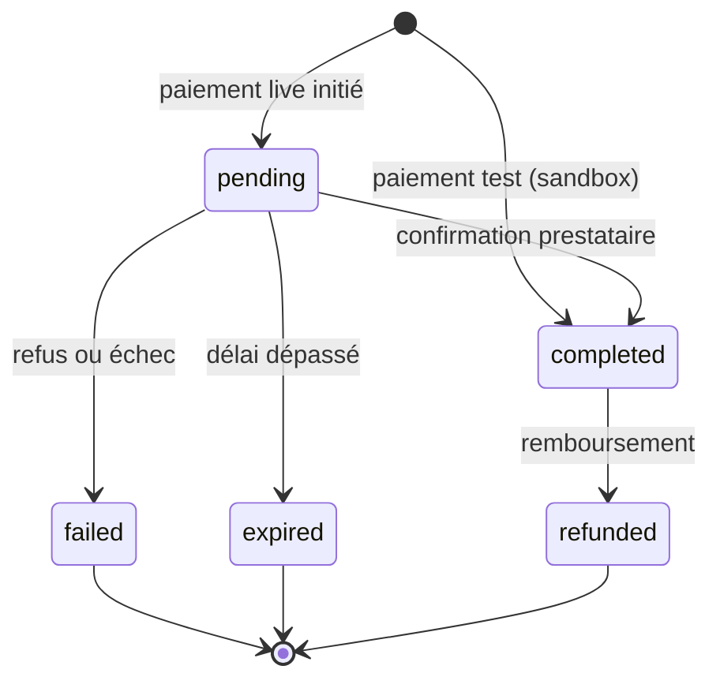

import { Accordion, Accordions } from 'fumadocs-ui/components/accordion';

Référence canonique du cycle de vie des paiements dans lomi. Détails d’implémentation : [Pour les contributeurs](#pour-les-contributeurs).

## Cycle entrée d’argent

## Statuts de transaction

| Statut | Signification |
| --- | --- |
| `pending` | Initié ; résultat final non confirmé (fréquent en **live**). |
| `completed` | Succès ; solde et frais selon les règles plateforme. |
| `failed` | Échec du paiement. |
| `expired` | Délai d’attente dépassé. |
| `refunded` | Remboursement sur le paiement d’origine. |

## Correspondance prestataire

| Statut transaction | Statut prestataire |
| --- | --- |
| `completed` | `succeeded` |
| `pending` | `processing` |
| `failed` | `cancelled` |
| `expired` | `expired` |
| `refunded` | `refunded` |

## Guides associés

- [Cycle de vie des paiements](/build/guides/payment-lifecycle)
- [Vérifier les paiements](/build/guides/verify-payments)
- [Comportement checkout](/build/payments/checkout-behavior)

<Accordions type="single">
  <Accordion title="Pour les contributeurs" id="pour-les-contributeurs">
    Alignement serveur : `create_transaction`, `update_transaction_status`, jobs d’expiration et soldes dans `apps/api`. Après modification, mettre à jour cette page et lancer `pnpm docs:drift`.
  </Accordion>
</Accordions>
