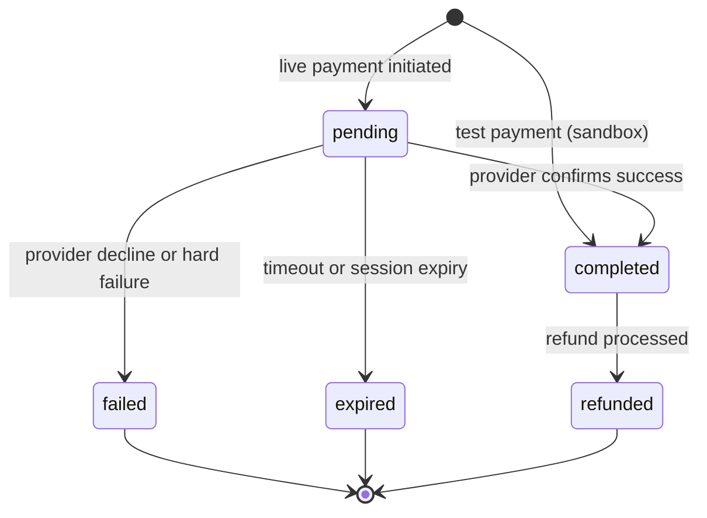

import { Accordion, Accordions } from 'fumadocs-ui/components/accordion';

Canonical behavior reference for payment lifecycle logic in lomi. For implementation details (database functions, jobs), see [For contributors](#for-contributors).

## Money-in lifecycle

In **test**, new payments often start as `completed` immediately. In **live**, they typically start `pending` until the customer approves mobile money or the card issuer confirms.

## Transaction statuses

| Status | Meaning |
| --- | --- |
| `pending` | Payment initiated; final outcome not yet confirmed (typical in **live**). |
| `completed` | Payment succeeded; merchant balance and fees settle per platform rules. |
| `failed` | Payment did not succeed (including some expiration paths). |
| `expired` | Pending payment timed out. |
| `refunded` | Refund processed against the original payment. |

## Provider-facing status mapping

Platform `transaction_status` is reflected in `provider_payment_status` on linked provider records:

| Transaction status | Provider payment status |
| --- | --- |
| `completed` | `succeeded` |
| `pending` | `processing` |
| `failed` | `cancelled` |
| `expired` | `expired` |
| `refunded` | `refunded` |

See [Transactions](/build/transactions) for field names in API responses.

## Status updates: idempotency and metadata

When status moves to `completed`:

- **Duplicate completion** does not double-apply balance: metadata is merged, but balance is credited once.
- **Metadata is merged**, not replaced, so webhook retries can append fields safely.

## Pending expiration

Pending transactions can be expired by scheduled jobs:

- By **age** (e.g. older than N hours).
- Optionally by **provider session expiry** (e.g. Wave session `when_expires`).

Expired rows carry `expiration_info` in metadata describing why they closed.

## What happens on `completed`

1. **Coupon usage** may be incremented.
2. **Balances** update via an idempotent path (`metadata.balance_updated` prevents double crediting).
3. **Subscriptions** linked to the transaction may move from `pending` to `active`.

For balance timing, see [Balance and settlement](/build/balance-and-settlement).

## Related guides

- [Payment lifecycle (Build)](/build/guides/payment-lifecycle)
- [Verify payments](/build/guides/verify-payments)
- [Checkout behavior](/build/payments/checkout-behavior)
- [Handling webhooks](/build/advanced-guides/handling-webhooks)

<Accordions type="single">
  <Accordion title="For contributors" id="for-contributors">
    Server-side alignment: `create_transaction`, `update_transaction_status`, expiration jobs, and balance updates in `apps/api`. When changing status semantics, update this page and run `pnpm docs:drift` in `apps/docs`.
  </Accordion>
</Accordions>
